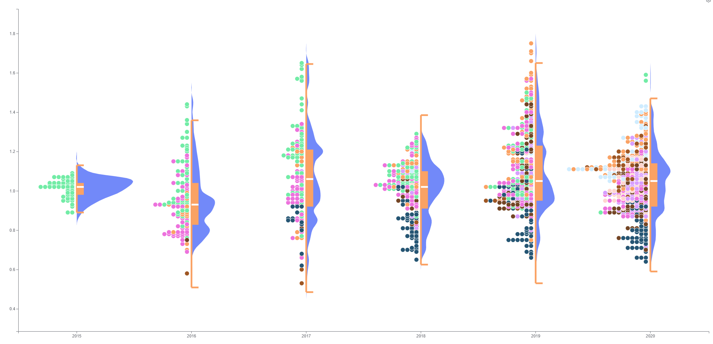
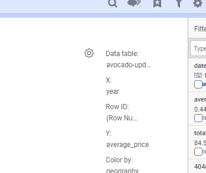
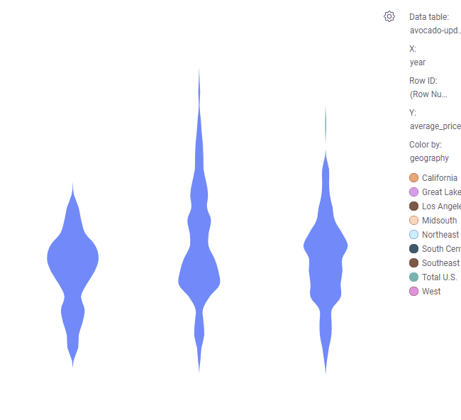
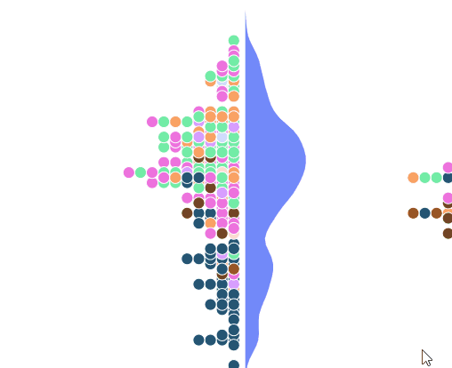
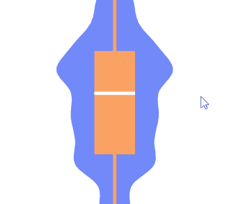

# D3 Violin Plot Implementation

This is a mod example demonstrating a violin chart written in `TypeScript`, rendered with `d3` and bundled with `Webpack`. It was based on the spiderchart demo project.
All source code for the mod example can be found in the `src` folder. Other necessary files reside in the `static` folder. Read below for further explanation.

## Prerequisites
These instructions assume that you have [Node.js](https://nodejs.org/en/) (which includes npm) installed.

## How to get started (with development server)

- Open a terminal at the location of this example.
- Run `npm install`. This will install necessary tools. Run this command only the first time you are building the mod and skip this step for any subsequent builds.
- Run `npm start`. This will compile TypeScript to JavaScript and place the bundle in the `dist` folder. This task will watch for changes in code and will continue running until it is stopped. Whenever you save a file, the changes will be reflected in the visualization mod.
- Run `npm run server` in a separate terminal. This will start a development server.
- Start editing, for example `src/main.ts`.
- In Spotfire, follow the steps of creating a new mod and connecting to the development server.

## Working without a development server

- Open a terminal at the location of this example.
- Run `npm install`. This will install necessary tools. Run this command only the first time you are building the mod and skip this step for any subsequent builds.
- Run `npm run build`. This will bundle the JavaScript and place it in the `dist` folder. It also copies the contents of `static` into `dist`. This task will not watch for changes in code.
- In Spotfire, follow the steps of creating a new mod and then browse for, and point to, the _manifest_ in the `dist` folder.

## About the Mod and Data

We had previoulsy done simple violin plots using JSViz but we hadn't seen any using mods that fit all the business requirements. There was a need for a visualization to show all the summary data you typically can find in a box plot but also we needed to be able to easily visualize data distrubtion all within the same plot.

The violin plot was picked because it does everything a box plot can do and then some more. As amazing as box plots can be they unfortunately do not reflect changes in data distribution as it can be seen below

For the example, the dataset we are using is avocado sales data(https://www.kaggle.com/neuromusic/avocado-prices). It gives us the average price and amount of avocados sale per State per year.

## Visualization Concepts

For an accurate violin plot it is important to send non aggregated data since we will be using all the individual points for data distribution. Of course, you can aggregate data but that might affect the shape of the violin.

The area of the violin plot represents the data distribution. But to enhance the violin plot we included additional features which can be accessed by clickin on the gear icon which is at the top right corner. From there you can choose the violin type: 
- Normal: that's what you start with which will just display the violin.
- History: no smoothing is applied and the violin plot looks more like a histogram.
- With Data Points: this will split the violins into two. The left half will have the individual data points and the other half will have the regular violin.
 
In the same properties dialog mentioned above you can select "Include Box Plot" which will draw a box plot on top of the violin. 

## Axis
- Y Axis: Continuous value. it is recommended to select None for the aggregation here as that could affect the shape of the violin.
- X Axis: Categorical value. 
- Row ID: to ensure you are sending unique rows without aggregation it is recommmended setting this axis to `Row Number`
- Color By: This axis affects the color of the individual points(represented as circles). 

## Interaction with DXP
- Marking: for this mod we implemented lasso marking. Just click anywhere on the screen and drag mouse to draw a lasso which will mark the data. This only works for the individual points. If you press left shift key, you can add to marking. 
- Tooltips: Both data points and box plot have tooltips tha display additional data. 
- Filtering: Violin should respond to any filtering operation you perform.